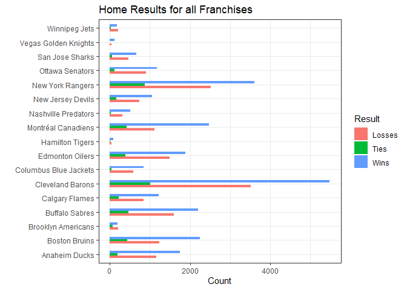
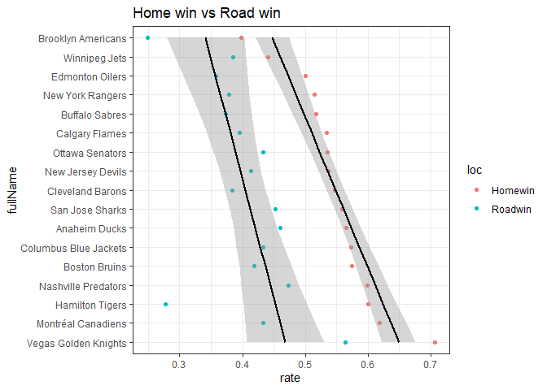
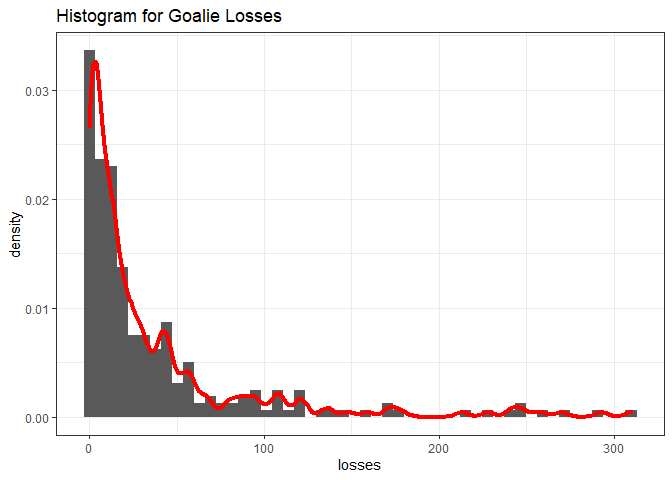

ST558 Project 1
================

  - [Packages Required](#packages-required)
  - [Create Functions for Listed
    Endpoint](#create-functions-for-listed-endpoint)
      - [Basic Function for a List from
        API](#basic-function-for-a-list-from-api)
      - [Functions for Listed
        endpoints](#functions-for-listed-endpoints)
          - [Function for Franchise ID](#function-for-franchise-id)
          - [Function for
            Franchise-team-totals](#function-for-franchise-team-totals)
          - [Function to Season Records](#function-to-season-records)
          - [Function for Goalie Records](#function-for-goalie-records)
          - [Function for Skater](#function-for-skater)
          - [Function for Admin History](#function-for-admin-history)
      - [Function for team.stats
        Modifier](#function-for-team.stats-modifier)
      - [Wrapper function](#wrapper-function)
  - [Basic Exploratory Data Analysis
    (EDA)](#basic-exploratory-data-analysis-eda)
      - [Get all the Data](#get-all-the-data)
      - [Franchises overall
        Performance](#franchises-overall-performance)
          - [Home Win/Tie/Loss Count (Bar
            Plot)](#home-wintieloss-count-bar-plot)
          - [Home/Road Win Rate](#homeroad-win-rate)
          - [Relationship between Home/Road Win Rate (Scatter
            Plot)](#relationship-between-homeroad-win-rate-scatter-plot)
      - [Goalie](#goalie)
          - [Goalie Losses (Histogram
            Plot)](#goalie-losses-histogram-plot)
  - [Output to README.md](#output-to-readme.md)

# Packages Required

``` r
library(httr)
library(jsonlite)
library(tidyverse)
library(ggplot2)
library(knitr)
```

# Create Functions for Listed Endpoint

``` r
base_url <- 'https://records.nhl.com/site/api'
username <- 'jzhao43@ncsu.edu'
password <- 'OjRlMTZjNDEyNTJjZDViZWU1NmJmODJhY2E1ZTA2YWIx'
```

## Basic Function for a List from API

``` r
getlist <- function(uname = username, pa = password, ep){
  full_url <- paste0(base_url, '/', ep)
  temp_get <- GET(full_url, authenticate(username, password, type = 'basic'))
  temp_json <- content(temp_get, 'text')
  temp_list <- fromJSON(temp_json, flatten = T)
  return(temp_list)
}
```

## Functions for Listed endpoints

### Function for Franchise ID

``` r
getid <- function(un = username, pas = password){
  temp <- getlist(un,pas,ep = 'franchise')
  dat <- temp[[1]] %>%
    select(id, firstSeasonId, fullName)
  return(dat)
}
```

### Function for Franchise-team-totals

``` r
getstat <- function(un = username, pas = password){
  temp <- getlist(un,pas,ep = 'franchise-team-totals')
  dat <- temp[[1]] %>%
  select(!c(id,activeFranchise,gameTypeId,lastSeasonId,teamId, teamName, triCode)) %>%
  group_by(firstSeasonId) %>%
  summarise_each(funs(sum(., na.rm = T)))
  return(dat)
}
```

### Function to Season Records

``` r
getseason <- function(frid){
  temp <- getlist(ep = paste0('franchise-season-records?cayenneExp=franchiseId=',frid))
  return(temp[[1]])
}
```

### Function for Goalie Records

``` r
getGoalie <- function(frid){
  temp <- getlist(ep = paste0('franchise-goalie-records?cayenneExp=franchiseId=',frid))
  return(temp[[1]])
}
```

### Function for Skater

``` r
getSkater <- function(frid){
  temp <- getlist(ep = paste0('franchise-skater-records?cayenneExp=franchiseId=',frid))
  return(temp[[1]])
}
```

### Function for Admin History

``` r
getHis <- function(frid){
  temp <- getlist(ep = paste0('franchise-detail?cayenneExp=mostRecentTeamId=',frid))
  return(temp[[1]])
}
```

## Function for team.stats Modifier

``` r
stat_url <- 'https://statsapi.web.nhl.com/api/v1/teams/'
getteamstat <- function(frid=NA){
  if (is.na(frid)){
    full_url <- stat_url
  } else {
    full_url <- paste0(stat_url,frid, '/?expand=team.stats')
  }
  temp_get <- GET(full_url, authenticate(username, password, type = 'basic'))
  temp_json <- content(temp_get, 'text')
  temp_list <- fromJSON(temp_json, flatten = T)
  return(temp_list[[2]])
}
```

## Wrapper function

``` r
getany <- function(type, frid=NA){
  if (is.na(type)){
    stop('Please input a type from id/stat/season/Goalie/Skater/His/teamstat.')
  }
  tempname <- c('id','stat','season','Goalie','Skater','His','teamstat')
  if (!type %in% tempname) {stop('Wrong type!')}
  if (is.na(frid)){
    if (type=='id'){return(getid())}
    if (type=='stat'){return(getstat())}
    if (type=='teamstat'){return(getteamstat())}
  } else {
    if (type=='season'){return(getseason(frid))}
    if (type=='Goalie'){return(getGoalie(frid))}
    if (type=='Skater'){return(getSkater(frid))}
    if (type=='His'){return(getHis(frid))}
    if (type=='teamstat'){return(getteamstat(frid))}
  }
}
```

# Basic Exploratory Data Analysis (EDA)

## Get all the Data

``` r
allid <- getany('id')
allstat <- getany('stat')

# Write a loop to collect season records for all franchises
allseason <- NA
for (i in allstat$franchiseId){
  temp <- getany('season',i)
  allseason <- rbind(allseason, temp)
}
allseason <- allseason[-1,]

## Write a loop to collect Goalie records for all franchises
allGoalie <- NA
for (i in allstat$franchiseId){
  temp <- getany('Goalie',i)
  allGoalie <- rbind(allGoalie, temp)
}
allGoalie <- allGoalie[-1,]

# Get team-stat
allteam <- getteamstat()
```

## Franchises overall Performance

### Home Win/Tie/Loss Count (Bar Plot)

I would like to have a view about every franchises’ performance at home
city. A bar plot should be intuitive enough.

``` r
# Join the Data
Join <- left_join(allid, allstat, by='firstSeasonId') %>%
  distinct(firstSeasonId, .keep_all = T)

# Minus the NA
Join <- Join[!is.na(Join$franchiseId),]

# Reshape the data
bar.plot <- Join %>%
  select(fullName, homeLosses, homeTies, homeWins) %>%
  gather(key = 'result', value = 'value', 2:4)

# Bar plot
ggplot(data = bar.plot) + geom_bar(aes(x=fullName,y=value,fill=result),stat="identity",width=0.5, position = 'dodge') + theme_bw() + coord_flip() + 
  labs(x='', y='Count', title = 'Home Results for all Franchises', fill='Result') + scale_fill_discrete(labels=c('Losses','Ties','Wins'))
```

<!-- -->

From this plot we know that home field advantage does exist. Nearly all
the franchises (except those only participated in a few games) have won
more games than they lost. Besides, **Cleveland Barons** has the highest
win count (as well as the loss count), it is the most active team. From
the plot it looks like that **Montreal Canadiens** has the highest home
win rate. So I want to calculate the numeric result.

### Home/Road Win Rate

I decided to calculate the home and road win rate for all the
franchises. I’ll define the win rate by
\(Win=\frac{Win}{Win+Tie+Loss}\).

``` r
# Calculate home/road win rates and rank it
winrate <- Join %>%
  group_by(fullName) %>%
  summarise(Homewin=homeWins/(homeWins+homeTies+homeLosses), Roadwin=roadWins/(roadWins+roadTies+roadLosses)) %>%
  arrange(desc(Homewin), desc(Roadwin))

# Spin the data.frame
temp <-data.frame(t(winrate))
names(temp) <- winrate$fullName
temp <- temp[-1,]
for (i in 1:17){
  temp[,i] <- as.numeric(as.character(temp[,i]))
}

# Table output
temp %>%
  kable(digits = 2, col.names = NA)
```

|         | Vegas Golden Knights | Montréal Canadiens | Hamilton Tigers | Nashville Predators | Boston Bruins | Columbus Blue Jackets | Anaheim Ducks | San Jose Sharks | Cleveland Barons | New Jersey Devils | Ottawa Senators | Calgary Flames | Buffalo Sabres | New York Rangers | Edmonton Oilers | Winnipeg Jets | Brooklyn Americans |
| ------- | -------------------: | -----------------: | --------------: | ------------------: | ------------: | --------------------: | ------------: | --------------: | ---------------: | ----------------: | --------------: | -------------: | -------------: | ---------------: | --------------: | ------------: | -----------------: |
| Homewin |                 0.71 |               0.62 |            0.60 |                0.60 |          0.57 |                  0.57 |          0.57 |            0.56 |             0.55 |              0.54 |            0.54 |           0.53 |           0.52 |             0.52 |            0.50 |          0.44 |               0.40 |
| Roadwin |                 0.56 |               0.43 |            0.28 |                0.47 |          0.42 |                  0.43 |          0.46 |            0.45 |             0.38 |              0.41 |            0.43 |           0.39 |           0.37 |             0.38 |            0.36 |          0.38 |               0.25 |

**Golden Knights** has the highest home win rate, but from the previous
bar plot, we can see that **Golden Knights** actually only participated
a little games. Considering about the number of matches, **Montreal
Canadiens** performs best at home field.

### Relationship between Home/Road Win Rate (Scatter Plot)

For all franchises, their home win rates is larger than road win rates.
But are there any other variables can affect home/road win rate? Are the
difference between home/road win rate only depends on teams? I decided
to plot a scatter plot to explore.

``` r
# reshape data
sc.plot <- winrate %>%
  gather(key = 'loc', value = 'rate',2:3)
sc.plot$fullName <- factor(sc.plot$fullName, levels = sc.plot$fullName[1:17],ordered = T)

ggplot(data = sc.plot,aes(x=fullName,y=rate,group=loc)) + geom_point(aes(color=loc)) + geom_smooth(aes(group=loc), method = lm,color='black', formula = y~x) + labs(title = 'Home win vs Road win') + theme_bw() + coord_flip()
```

<!-- -->

I ranked the Home win rate from high to low first, and then want to
compare it’s tendency with road win rate’s. Although there’s some
outliers exist, the linear regression of home/road sets of win rate is
basically parallel. That’s means home/road competition actually fair
enough for most of franchises, because their difference between
home/road sets remain constant.

**Hamilton Tigers** contributes a outlier in this plot, the difference
between its home/road win rate is much larger than the others. That’s
because **Hamilton Tigers** only joined in a few matches.

## Goalie

### Goalie Losses (Histogram Plot)

I want to explore if the distribution of all the goalies’ losses fit the
normal distribution. So here’s the histogram
plot.

``` r
ggplot(data = allGoalie,aes(x=losses,y=..density..)) + geom_histogram(bins = 50) + geom_density(size=1.5, color = 'red',adjust=2.5/6)+labs(title = 'Histogram for Goalie Losses') + theme_bw()
```

<!-- -->

Unfortunately, it has nothing like a normal distribution, but more like
a reciprocal function or exponential function. It is extremely left
skewed, that is, most of them only have a few losses while the right
tail lag a lot. I guess that’s because only a few of goalies can play
regularly, and they evenly distributed from 100 losses to 300 losses.
Most of goalies are freshmen or had to sit off the court.

# Output to README.md

``` r
# rmarkdown::render('temp.md', output_file = 'README.md')
```
